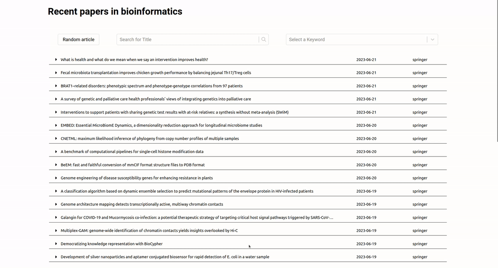

# Recent Articles in Bioinformatics

This is a code repository for a web application, that allows users to view newest research papers, corrections and news-pieces published in the field of bioinformatics. Provided web application is focued on responsiveness and usability as well as accessibility. 

Design principles behind it are: simplicity, conciseness and readability. 

## Features

### Quickly look through paper summaries

### Search and filter

## Future directions

For now only articles from one publisher: Springer, are collected in the database but the backend service used by the application is written in an extensible manner, to facilitate adding new information sources in the future.

## Technologies used in the project

Rust programming language was used for the backend API, because of its focus on code correctness, performance and its use of high-level, zero-cost abstractions (those built into the language as well as those provided by third party libraries.) 

Backend API makes use of asynchronous runtime provided by Tokio to further enhance performance.

It exposes several endpoints for the web application to interact with the underlying data repository . We used MongoDB as this data repository, to which data gathered via Spriner API is saved. It's mostly done to make our service at least partially independent from the changes and possible future problems with Springer API.

Web application itself is written using React.js to allow for responsive, clean UI/UX, and makes use of React libraries focused on accessibility.

 - Rust with [Tokio](https://tokio.rs/) and [Axum](https://docs.rs/axum/latest/axum/) for backend
 - [MongoDB](https://www.mongodb.com/) for data repository
 - [React.js](https://react.dev/) for frontend

### External APIs reference
 - [Springer API](https://dev.springernature.com/)
